# FoundryVTT - Token Attacher
 

 
  

**[Compatibility]**: *FoundryVTT* v10+ 
**[Systems]**: *any*  
**[Languages]**: *English*, *Korean*, *Japanese*    

Attach anything(even other tokens and their attached elements aswell) to tokens, so that they move when the token moves and rotate/move when the token rotates.
Resizing the base token will also resize all attached elements.

Baileywiki created a great showcase and tutorial video for the 4.0 release. I recommend it if you're updating from 3.x to 4.0 or if you haven't yet used Token Attacher at all: https://www.youtube.com/watch?v=2i0TX0BS8Vg

Attached elements can no longer be selected via the rectangle selection tool of each layer, unless the attach ui of the base token is open or you use the unlock feature. 
Attached elements can still be interacted with via double left or right click.
Attached elements can no longer move independently of the base token.
When dragging an prefab to the canvas the attached tiles will be sorted to the top(but still respect their z order inside the prefab).

To be able to attach measure templates, lights, sounds and journals you need the select-tool-everywhere module, as of writing this there is no select tool in those controls.
You can also attach those by using the new all layer select tool in combination with a select tool on a layer like the token layer.

## Table of Contents
 - [Macros](#macros)
 - [Known Issues](#known-issues)
 - [Installation](#installation)
 - [Usage](#usage)
	- [Open attach UI](#open-attach-ui)
	- [Attach or detach element](#attach-or-detach-element)
	- [Attach with multi layer selection tool](#attach-with-multi-layer-selection-tool)
	- [Detach all elements](#detach-all-elements)
	- [Enable selection of attached element](#enable-selection-of-attached-element)
	- [Highlight attached elements](#highlight-attached-elements)
	- [Copy and paste attached elements from one base to another](#copy-and-paste-attached-elements-from-one-base-to-another)
	- [Quickly reposition attached element with Quick Edit Mode](#quickly-reposition-attached-element-with-quick-edit-mode)
	- [Make a prefab](#make-a-prefab)
	- [Export compendiums with prefabs](#export-compendiums-with-prefabs)
	- [Resize base and children](#resize-base-and-children)
	- [Automatic resizing on different grid size](#automatic-resizing-on-different-grid-size)
	- [Allow movement in base token area](#allow-movement-in-base-token-area)
 - [Contact](#contact)
 - [Credits](#credits)

## Macros

A public interface for usage in macros can be accessed via tokenAttacher, following functions can be called:
 - tokenAttacher.attachElementToToken(element, target_token, suppresNotification=false)
 - tokenAttacher.attachElementsToToken(element_array, target_token, suppresNotification=false)
 - tokenAttacher.detachElementFromToken(element, target_token, suppressNotification=false)
 - tokenAttacher.detachElementsFromToken(element_array, target_token, suppressNotification=false)
 - tokenAttacher.detachAllElementsFromToken(target_token, suppressNotification=false)
 - tokenAttacher.getAllAttachedElementsOfToken(target_token, suppressNotification=false)
 - tokenAttacher.getAllAttachedElementsByTypeOfToken(target_token, type, suppressNotification=false)
 - tokenAttacher.setElementsLockStatus(elements, isLocked, suppressNotification = false)
 - tokenAttacher.setElementsMoveConstrainedStatus(elements, canMoveConstrained, suppressNotification = false)
 - tokenAttacher.regenerateLinks(elements)
 - tokenAttacher.migrateElementsInCompendiums(migrateFunc, elementTypes, topLevelOnly)
 - tokenAttacher.migrateAttachedOfBase(base, migrateFunc, elementTypes, topLevelOnly, return_data=false)

There are some example macros bundled in a macro compendium.
 - Mount Up!:
   - Select your token and target another token, click 'Mount Up!' to mount the target on the closest space.
 - Pick Up:
   - Select your token and target another token, click 'Pick Up' to attach the target to your token at the position it is right now.
 - Follow Target!:
   - Select your token and target another token, click 'Follow Target!' to follow the target with your token at the position it is right now.
 - Dismount/Drop all:
   - Select a token and click 'Dismount/Drop all' to drop all picked up tokens, drop all riders that have mounted it and cause all followers to stop following you.
 - Dismount/Drop Target:
   - Select your token and target another token, click 'Dismount/Drop Target' to drop the target if you previously picked it up, it has mounted you or is following you.
 - Stop Follow:
   - Select your token and target another token, click 'Stop Follow' to stop following the target.
 - Create Template and attach to Token:
   - Select your token and press the macro.
 - Remove Template from Token:
   - Select your token and press the macro.

Also there are some GM only macros in the macro compendium
 - Delete Missing Links:
   - If a prefab didn't get created correctly this will delete all broken elements. You might need to call it mutliple times.
 - Toggle Quick Edit Mode:
   - QoL macro that toggles Quick Edit Mode if you don't want to switch to the token layer every time.
 - Toggle hidden base+children:
	 - This toggle the hidden state on the base token and it's children(only works for tokens, tiles and drawings)
 - Propagate base hidden state to children:
	 - This propagates the hidden state of the base token to it's children(only works for tokens, tiles and drawings)

Simple Macro Example:
```
(async () => {
const some_element = canvas.tiles.children[0].children[0];
const some_token = canvas.tokens.children[0].children[0];
await tokenAttacher.attachElementToToken(some_element, some_token, true);

const all_attached = await tokenAttacher.getAllAttachedElementsOfToken(some_token);
const all_attached_tiles = await tokenAttacher.getAllAttachedElementsByTypeOfToken(some_token, "Tile");
console.log(all_attached);
console.log(all_attached_tiles);
console.log(canvas.tiles.get(all_attached_tiles[0]));
})();
```

## Known Issues

 - Moving multiple tokens at the same time doesn't work. Don't do it. If you do it you can fix misalignments by moven each token seperatly afterwards. Also if you need to do it you can attach all tokens to a base token and move the base token, that should cause no issue.
 - Multi Level Tokens and Vehicles & Mechanism are not fully compatible yet. See for example baileywiki's assets and videos to see what is currently possible. 
 - When dropping a prefab on a scene and then switching the scene or deleting the base token before the "Post processing is done" message shows up can result in broken attachments. Remove them with the 'Delete Missing Links' macro.
   
## Installation

1. token-attacher using manifest URL: https://raw.githubusercontent.com/KayelGee/token-attacher/master/module.json
2. While loaded in World, enable **_Token Attacher_** module.

## Usage
 - [Open attach UI](#open-attach-ui)
 - [Attach or detach element](#attach-or-detach-element)
 - [Attach with multi layer selection tool](#attach-with-multi-layer-selection-tool)
 - [Detach all elements](#detach-all-elements)
 - [Enable selection of attached element](#enable-selection-of-attached-element)
 - [Highlight attached elements](#highlight-attached-elements)
 - [Copy and paste attached elements from one base to another](#copy-and-paste-attached-elements-from-one-base-to-another)
 - [Quickly reposition attached element with Quick Edit Mode](#quickly-reposition-attached-element-with-quick-edit-mode)
 - [Make a prefab](#make-a-prefab)
 - [Export compendiums with prefabs](#export-compendiums-with-prefabs)
 - [Resize base and children](#resize-base-and-children)
 - [Automatic resizing on different grid size](#automatic-resizing-on-different-grid-size)
 - [Allow movement in base token area](#allow-movement-in-base-token-area)


### Open attach UI
Select a token and open the attaching UI.

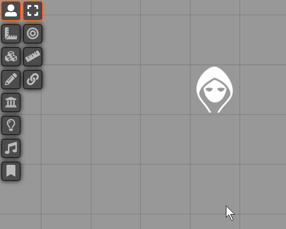

### Attach or detach element
Attach or detach an element by selecting it and pressing the attach or detach button.

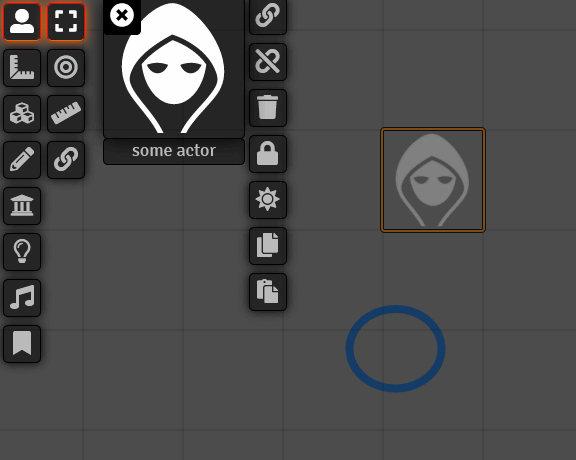

### Attach with multi layer selection tool
Attach elements on multiple layer with the rectangle select tool.

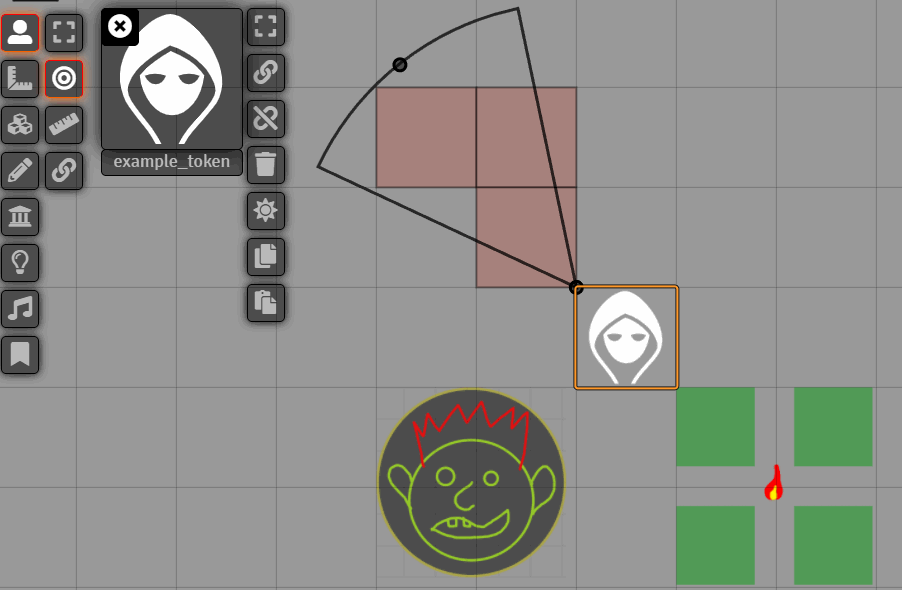

### Detach all elements
Detach all elements by clicking the detach all button.

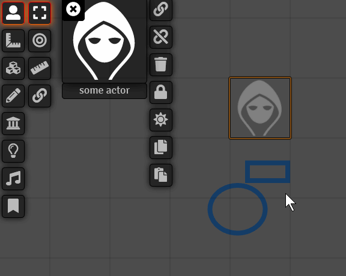

### Enable selection of attached element
Enable selection of an attached element by selecting the element and then pressing the unlock button. To prevent the selection again use the lock button.

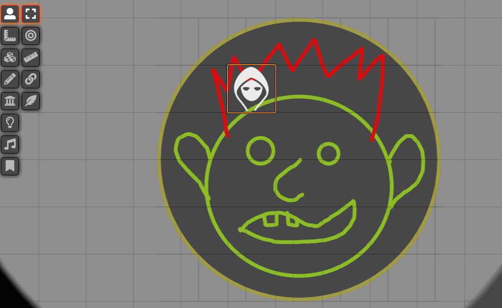

### Highlight attached elements
Highlight your attached elements by pressing the highlight button.

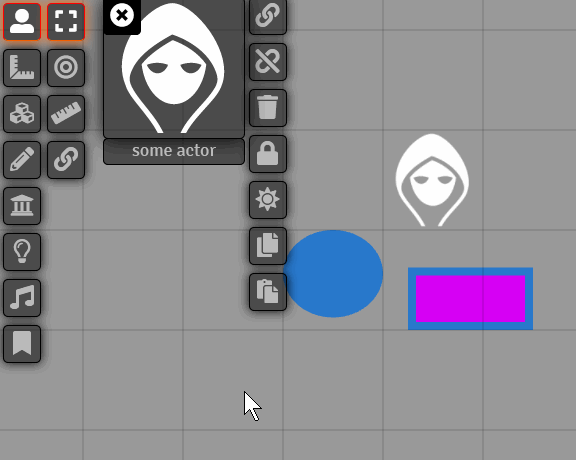

### Copy and paste attached elements from one base to another
Copy and paste all attached elements by pressing the copy button on the source token and the paste button on the target token.

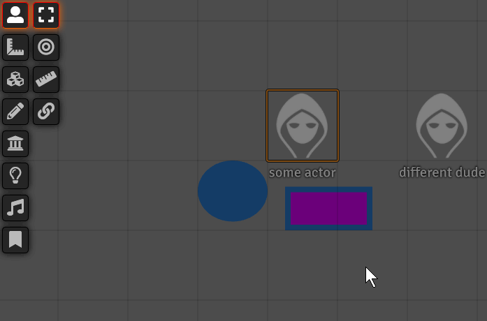

### Quickly reposition attached element with Quick Edit Mode
Quickly reposition attached elements without opening the attachment ui by clicking the Quick Edit Button, move attachments and then finish by clicking the Quick Edit Button again.

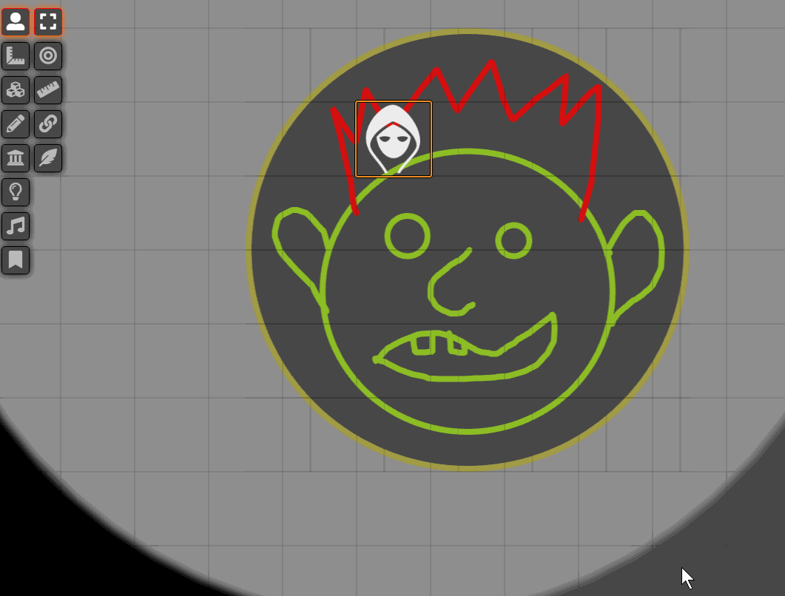

### Make a prefab
Make a prefab by adding a token with attached elements to the prototype Token of an Actor.
The grid size of the current scene will be saved to the prefab, so when you drag the prefab out on a scene with a different grid size it will resize accordingly.

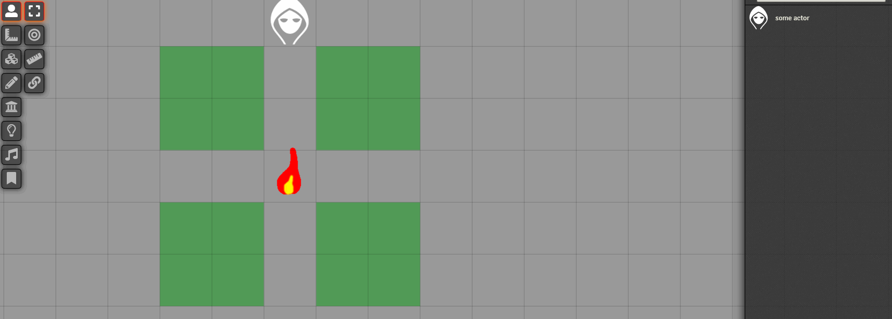

### Export compendiums with prefabs
Export compendiums with prefabs. Copy the resulting json into a .json file. To see how to auto import compendiums(so that this works between systems) in your module see my example module: https://github.com/KayelGee/token-attacher-compendium-example

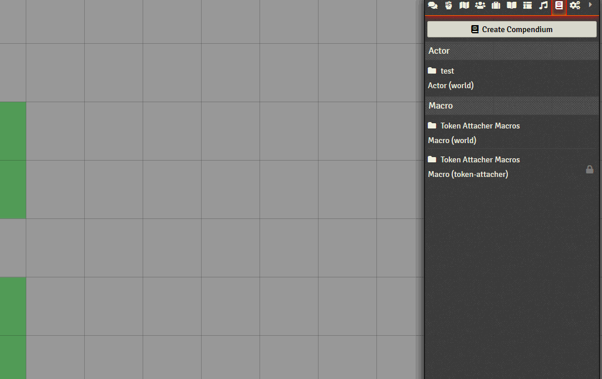

### Resize base and children
Resize the whole chain by resizing the base token.

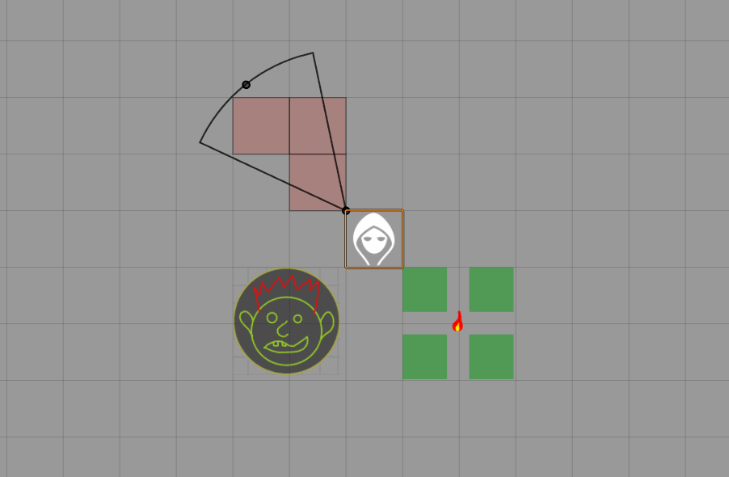

### Automatic resizing on different grid size
Auto resizing when the grid size differs from what the prefab was saved with.

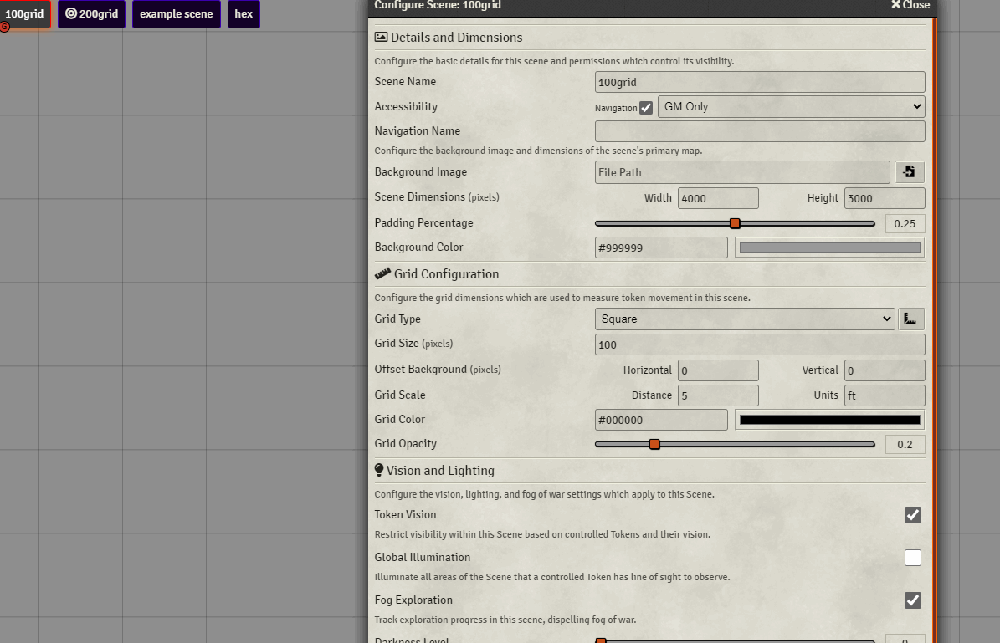

### Allow movement in base token area
Enable canMoveConstrained flag with API call to `setElementsMoveConstrainedStatus`(see Mount Up! macro), then move the token freely within the area of the base token.

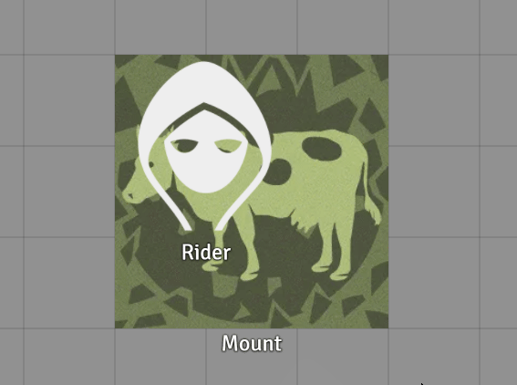

## Contact

If you wish to contact me for any reason, reach me out on Discord using my tag: `KayelGee#5241`

## Credits

Korean translation provided by KLO

Japanese translation provided by touge
