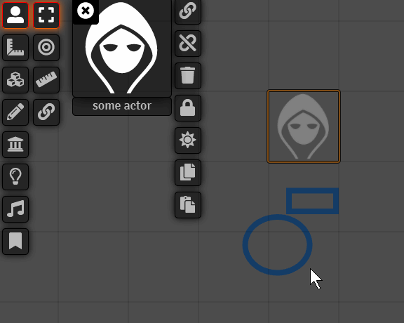

# FoundryVTT - Token Attacher
 
 
  

**[Compatibility]**: *FoundryVTT* 0.7.0+  
**[Systems]**: *any*  
**[Languages]**: *English*  

Attach anything(except other tokens) to tokens, so that they move when the token moves and rotate/move when the token rotates. 

To be able to attach measure templates, lights, sounds and journals you need the select-tool-everywhere module, as of writing this there is no select tool in those controls.

A public interface for usage in macros can be accessed via tokenAttacher, following functions can be called:
 - tokenAttacher.attachElementToToken(element, target_token, suppresNotification=false)
 - tokenAttacher.attachElementsToToken(element_array, target_token, suppresNotification=false)
 - tokenAttacher.detachElementFromToken(element, target_token, suppressNotification=false)
 - tokenAttacher.detachElementsFromToken(element_array, target_token, suppressNotification=false)
 - tokenAttacher.detachAllElementsFromToken(target_token, suppressNotification=false)

## Known Issues
 - Moving multiple tokens at the same time doesn't work. Don't do it.
 - Locked elements can still be moved when selected with unlocked elements via box select
 - Assign Token doesn't clear flags, so to be sure you should always assign to a fresh actor
 - Moving a token rapidly(by holding a keyboard arrow key for example) will cause the attached elements to lag behind.

## Installation

1. token-attacher using manifest URL: https://raw.githubusercontent.com/KayelGee/token-attacher/master/module.json
2. While loaded in World, enable **_Token Attacher_** module.

## Usage

Select a token and open the attaching UI.

Attach or detach an element by selecting it and pressing the attach or detach button.

Detach all elements by clicking the detach all button.

Prevent attached elements from being interacted with by pressing the lock/unlock button.

Highlight your attached elements by pressing the highlight button.

Copy and paste all attached elements by pressing the copy button on the source token and the paste button on the target token.

Make a prefab by adding a token with attached elements to the prototype Token of an Actor.

## Contact

If you wish to contact me for any reason, reach me out on Discord using my tag: `KayelGee#5241`
